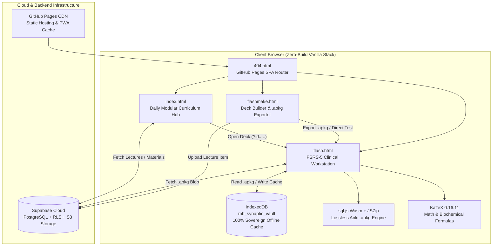

# MedicineBank Data & Neurova Clinical Flashcards Ecosystem

[](LICENSE)
[](https://data.medicinebank.org)
[](https://github.com/open-spaced-repetition/fsrs4anki)
[](https://katex.org/)
[](https://sql.js.org/)

An offline-first, clinical-grade medical curriculum portal and active-recall spaced repetition workstation designed for medical scholars, clinicians, and licensing candidates.

Live Production URL: **[https://data.medicinebank.org](https://data.medicinebank.org)**

---

## 1. System Architecture & Topology



---

## 2. Key Capabilities & Technological Features

### 🧠 True FSRS-5 Neural Scheduler
- **19-Parameter Calibrated Weight Vector**: Driven by modern memory research parameters ($w_0–w_{18}$).
- **Continuous Retrievability Decay**:
  $$R(t, S) = \left(1 + \text{factor} \cdot \frac{t}{S}\right)^{-0.5} \quad \text{where } \text{factor} = \frac{19}{81} \approx 0.2345679$$
- **Target Retention**: Configured for 90% optimal cognitive retention without burnout.
- **Dynamic Intervals**: Live interval calculation displayed on rating buttons (`< 10m`, `1d`, `3d`, `7d`).
- **Intra-Session Queue Recycling**: Lapsed cards rated **Again** are immediately re-queued for mastery before session completion.

### 📐 KaTeX Mathematical & Biochemical Formula Engine
- Native rendering of inline equations (`$formula$`) and block equations (`$$formula$$` or `\[formula\]`).
- Seamless rendering of clinical calculations, hemodynamics ($MAP$, $CO$, $SVR$, $EF$), acid-base physiology (Henderson-Hasselbalch), and pharmacokinetics.

### 📱 4-Direction Mobile Touch Ergonomics & Haptic Feedback
- **Tactile Swipes**:
  - **Swipe Left (←)**: Again (Rating 1)
  - **Swipe Down (↓)**: Hard (Rating 2)
  - **Swipe Right (→)**: Good (Rating 3)
  - **Swipe Up (↑)**: Easy (Rating 4)
  - **Tap / Quick Flick**: Reveal Answer
- **Dynamic Directional Glow**: Cards cast colored atmospheric lighting matching the rating direction.
- **Threshold Haptic Ticks**: Dispatches tactile vibration (`navigator.vibrate`) when crossing the 45px displacement zone.
- **HUD Compass Overlay**: Directional on-screen guides for mobile studying.

### 🔬 Clinical Diagram Lightbox Zoom
- High-resolution modal zoom for histology slides, gross anatomy figures, 12-lead ECG strips, and radiographic images.
- Instant pan, scale, and dismiss with `Esc` or background tap.

### ⏱️ Clinical Timers & USMLE Exam Pacing
- **Stopwatch Mode**: Tracks total active recall engagement.
- **60-Second USMLE Pacing Mode**: Simulates board exam question time constraints with amber warning at 30s and pulsing red alert at 15s.

### 🃏 Deck Maker & Bulk Importer (`flashmake.html`)
- Visual deck creator generating standard Anki 2.1-compatible `.apkg` files using SQLite Wasm (`sql.js`) and `JSZip`.
- **Toolbar Helpers**: Quick insert for `[+ Cloze {{c1::...}}]`, `[+ Math $...$]`, and `[+ Bold]`.
- **Live KaTeX Preview**: Real-time equation and cloze preview as you type.
- **Bulk Import**: Paste tab-delimited or semicolon-delimited lists to import dozens of cards in seconds.
- **Direct Test in Workstation**: 1-click test button launches the created deck immediately into `flash.html`.

### 🛡️ Sovereign IndexedDB Offline Vault
- Client-side database (`mb_synaptic_vault`) automatically stores downloaded decks, cards, and media blobs.
- Decks operate 100% offline without network connectivity or Supabase uptime dependencies.
- Built-in High-Yield Cardiovascular & Pharmacology Demo Deck for instant practice.

### 🎨 6 Clinical Color Themes & Bilingual Arabic/English Support
- Themes: **Dark** (Obsidian), **Light** (Clinical Ivory), **Maroon**, **Blue**, **Orange**, **Champagne**, and **Brown**.
- Typography: Precision pairings of **Inter** for Latin clinical prose and **Cairo** for Arabic medical terminology.

---

## 3. Keyboard & Gesture Controls

| Control | Action | Details |
| :--- | :--- | :--- |
| `Space` / `Enter` | **Reveal / Grade** | Flips card if hidden; grades "Good" if already flipped |
| `1` / Swipe Left (←) | **Again** | Lapsed card; re-queued into intra-session queue |
| `2` / Swipe Down (↓) | **Hard** | Challenging recall; shorter stability interval |
| `3` / Swipe Right (→) | **Good** | Successful recall; standard FSRS-5 exponential expansion |
| `4` / Swipe Up (↑) | **Easy** | Immediate mastery; maximum stability bonus |
| `Z` | **Undo** | Reverts last rating and restores previous card state |
| `B` | **Browse Deck** | Opens deck search and card inspector |
| `F` | **Focus Mode** | Toggles fullscreen distraction-free study |
| `Esc` | **Close** | Dismisses modals, lightbox zoom, or search panels |

---

## 4. Local Development & Deployment

This project requires **zero build tools** or compilers. All modules are pure ESM, Wasm, and modern standards-compliant web components that run directly in any browser.

### Running Locally
```bash
# Clone the repository
git clone https://github.com/l81e/Data.git
cd Data

# Launch any local static server
python -m http.server 8000
# Open http://localhost:8000
```

### GitHub Pages Deployment
1. Ensure GitHub Pages is configured to serve from the root (`/`) of branch `main`.
2. `CNAME` is configured to `data.medicinebank.org`.
3. `404.html` automatically handles SPA routing and clean URL redirects for `/flash` and `/flashmake`.

### Supabase Backend Setup
Execute `schema.sql` in the Supabase SQL Editor:
- Creates `year_of_view` enum.
- Establishes `lectures`, `materials`, `profiles`, and `flashcard_reviews` tables.
- Creates multi-column indexes for fast query execution.
- Enables Row Level Security (RLS) with public read access and optional guest uploads.

---

## 5. Security & Privacy
- **Client Sovereignty**: Studied cards, SRS intervals, and review logs are stored locally in IndexedDB.
- **Sanitized Outputs**: DOM insertions use text node escaping and sanitized HTML parsers to prevent XSS.
- **Anti-Zoom Hardening**: Viewport meta constraints and gesture handlers prevent accidental multi-touch zoom during intense study sessions.

---

## 6. License
Licensed under the [MIT License](LICENSE).
Medical students and educators are free to fork, customize, and extend.
